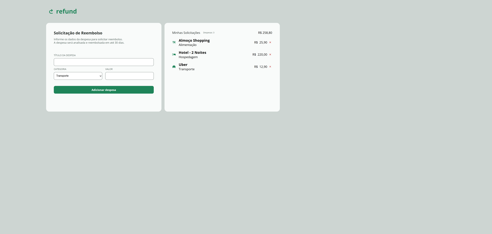

# 🧾 Refund — Solicitação de Reembolso

> Aplicação de solicitação de reembolso de despesas, desenvolvida com HTML, CSS e JavaScript com uso mínimo de IA.


---

## 📋 Sobre o Projeto

O **Refund** é uma aplicação web para solicitação de reembolso de despesas corporativas. O usuário informa o título, a categoria e o valor da despesa, que é adicionada dinamicamente à lista de solicitações com ícone correspondente à categoria. A aplicação exibe a contagem de despesas e o valor total atualizado em tempo real, além de permitir a remoção individual de cada item.

Este projeto representa uma evolução clara na minha jornada com JavaScript, combinando **manipulação do DOM**, **formulários**, **eventos** e **lógica de atualização de estado** em uma só aplicação. Assim como nos projetos anteriores, optei deliberadamente por utilizar o mínimo de IA possível, priorizando chegar ao resultado desejado por conta própria — o que pode ter gerado pontos passíveis de otimização, mas que fazem parte genuinamente da minha evolução como desenvolvedor.

---

## ✨ Funcionalidades

- ✅ Formulário com campos de título, categoria e valor
- ✅ Categoria selecionável: Alimentação, Hospedagem, Transporte, Serviços e Outros
- ✅ Despesas adicionadas dinamicamente à lista ao submeter o formulário
- ✅ Ícone correspondente à categoria exibido em cada despesa
- ✅ Contador de despesas atualizado em tempo real
- ✅ Valor total calculado e exibido automaticamente
- ✅ Remoção individual de despesas com atualização do total
- ✅ Validação nativa de campos obrigatórios com `required`

---

## 🖼️ Preview



---

## 🛠️ Tecnologias Utilizadas

| Tecnologia | Finalidade |
|------------|------------|
| HTML5 | Estrutura semântica e formulário de despesas |
| CSS3 | Estilização e layout da interface |
| JavaScript | Lógica da aplicação, DOM e atualização de estado |
| Google Fonts | Fonte Open Sans para tipografia limpa |

---

## 🧠 Foco Técnico — JavaScript Aplicado

Este projeto consolidou conceitos de JavaScript em uma aplicação com estado real. Alguns conceitos aplicados:

- Captura de dados do formulário com `addEventListener` e `event.preventDefault()`
- Criação dinâmica de elementos de lista com `document.createElement()` e `appendChild()`
- Leitura do valor de um `<select>` para definir o ícone e a categoria de cada despesa
- Cálculo e atualização do **valor total** a cada adição ou remoção de despesa
- Atualização do **contador de despesas** em tempo real no DOM
- Remoção de itens com `.remove()` e recalculo automático do total
- Manipulação de atributos e conteúdo de elementos via `innerHTML` e `.src`

---

## 📁 Estrutura de Pastas

```
📦 projeto-refund
├── 📄 index.html
├── 📄 script.js
├── 📁 styles/
│   └── style.css
└── 📁 assets/
    ├── refund-logo.svg
    ├── remove-button.svg
    ├── Alimentação.svg
    ├── Hospedagem.svg
    ├── Transporte.svg
    ├── Serviços.svg
    └── Outros.svg
```

---

## 🚀 Como Visualizar o Projeto

1. Clone o repositório:
```bash
git clone https://github.com/WallissonDev/projeto-refund.git
```

2. Acesse a pasta do projeto:
```bash
cd projeto-refund
```

3. Abra o arquivo `index.html` no navegador.

---

## 📚 Aprendizados

- Construção de uma aplicação com **estado dinâmico** gerenciado via JavaScript
- Uso de **formulários HTML** com captura e validação de dados
- **Criação e remoção de elementos** no DOM em tempo real
- Lógica de **cálculo acumulativo** para total de despesas
- Associação dinâmica de **ícones por categoria** via JavaScript
- Importância de **pensar o fluxo da aplicação** antes de escrever o código

---

## 👤 Autor

**Wallisson Moreira de Lima**

[](https://github.com/WallissonDev)

---

*Feito com 💙 e muita lógica própria.*
